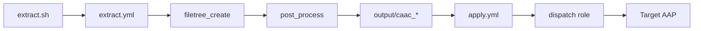

# clickopstocaac — AAP UI to Config-as-Code Extractor

Convert objects created in the Ansible Automation Platform (AAP) UI into executable **config-as-code** using the validated [`infra.aap_configuration`](https://github.com/redhat-cop/infra.aap_configuration) collection and its `dispatch` role.

Exports **Gateway (administrative)**, **Automation Controller**, and **Event-Driven Ansible (EDA)** objects. Automation Hub is intentionally excluded.

## Overview

```
AAP UI objects  →  Gateway/Controller API  →  output/caac_<timestamp>/  →  apply.yml  →  target AAP
```

Each extraction produces a self-contained directory you can commit to Git or copy to an external AAP environment for migration.

## Prerequisites

- Ansible 2.15+
- Network access to source AAP instance
- Read-only (or admin) credentials for AAP Gateway API
- Required collections (see [Collection Installation](#collection-installation))

## Collection Installation

```bash
./scripts/install-collections.sh
```

This installs:

| Collection | Purpose |
|---|---|
| `infra.aap_configuration` | Apply via `dispatch` role |
| `infra.aap_configuration_extended` | AAP 2.5+ export via `filetree_create` |
| `infra.controller_configuration` | AWX 20 / AAP 2.4 legacy export |
| `ansible.platform` | Gateway API plugin (from GitHub) |
| `ansible.controller` | Controller object apply |
| `ansible.eda` | EDA object apply |

If you have Red Hat Automation Hub access, you may install `ansible.platform`, `ansible.controller`, and `ansible.eda` from Automation Hub instead of Git/Galaxy.

## Quick Start

```bash
# 1. Source credentials (AAP_BASE is accepted as alias for AAP_URL)
source ~/.bashrc_eda_session

# 2. Install collections (once)
./scripts/install-collections.sh

# 3. Extract everything (controller + gateway + eda, no hub)
./scripts/extract.sh --filter all

# 4. Dry-run apply to same or external AAP
./scripts/apply.sh --check

# 5. Phased apply (recommended for migrations)
./scripts/apply.sh --phase organizations,credentials,projects --check
./scripts/apply.sh --phase eda --check
```

## Environment Variables

### Extract (source)

| Variable | Required | Description |
|---|---|---|
| `SOURCE_AAP_URL` / `AAP_URL` / `AAP_BASE` | Yes | Source AAP gateway URL or hostname |
| `SOURCE_AAP_USER` / `AAP_USER` | Yes* | Username for basic auth |
| `SOURCE_AAP_PASS` / `AAP_PASS` | Yes* | Password for basic auth |
| `SOURCE_AAP_TOKEN` / `AAP_TOKEN` | Yes* | OAuth token (preferred; skips token creation) |
| `SOURCE_AAP_VALIDATE_CERTS` / `AAP_VALIDATE_CERTS` | No | `true`/`false` (default: `false` for lab/CRC) |
| `CAAC_SOURCE_PLATFORM` | No | Platform profile: `awx20`, `awx24`, `aap24`, `aap25`, `aap26`, `aap27`, `auto` |
| `CAAC_TARGET_PLATFORM` | No | Target metadata (default: `aap27`) |
| `CAAC_MIGRATION_MODE` | No | Enable cross-version transforms (`true`/`false`) |

\* Provide either `AAP_TOKEN` or both `AAP_USER` and `AAP_PASS`.

Example credentials file (`~/.bashrc_eda_session`):

```bash
export AAP_BASE="https://aap-aap.apps-crc.testing"
export AAP_USER="admin"
export AAP_PASS="yourpassword"
export AAP_TOKEN="optional-oauth-token"
```

### Apply (target)

| Variable | Description |
|---|---|
| `TARGET_AAP_URL` / `AAP_URL` / `AAP_BASE` | **Gateway URL** on AAP 2.7+ (required) |
| `TARGET_AAP_TOKEN` / `AAP_TOKEN` | Gateway OAuth token (required on 2.7) |
| `TARGET_AAP_USER` / `AAP_USER` | Alternative basic auth |
| `TARGET_AAP_PASS` / `AAP_PASS` | Alternative basic auth |
| `TARGET_AAP_VALIDATE_CERTS` / `AAP_VALIDATE_CERTS` | `true`/`false` |

## CLI Reference

### extract.sh

```bash
./scripts/extract.sh --filter <filter> [OPTIONS]
```

| Option | Description |
|---|---|
| `--filter FILTER` | Comma-separated filter(s) (default: `all`) |
| `--source-platform PLAT` | `awx20` \| `awx24` \| `aap24` \| `aap25` \| `aap26` \| `aap27` \| `auto` |
| `--target-platform PLAT` | Target for apply bundle metadata (default: `aap27`) |
| `--migration-mode` | Enable cross-version transforms (org/credential maps, field strip) |
| `--org NAME` | Export only objects for this organization |
| `--org-map JSON` | Map org names for target, e.g. `'{"Old":"New"}'` |
| `--default-ee NAME` | Default EE for job templates missing execution environment |
| `--validate-certs BOOL` | Set certificate validation |
| `--creds-file PATH` | Credentials file (default: `~/.bashrc_eda_session`) |
| `-e, --extra-vars V` | Extra ansible-playbook `-e` argument |

### apply.sh

```bash
./scripts/apply.sh [--bundle PATH] [--phase PHASE] [--check]
```

| Phase | Dispatch tags |
|---|---|
| `all` | Everything in bundle |
| `gateway` / `admin` | Gateway administrative objects |
| `organizations` | Gateway organizations |
| `authenticators` | Gateway authenticators and maps |
| `settings` | Controller + gateway settings |
| `gateway_services` | Services, clusters, nodes, keys, ports, routes |
| `credential_types` | Credential types |
| `credentials` | Credentials |
| `projects` | SCM projects |
| `inventories` | Inventories |
| `job_templates` | Job templates |
| `workflow_job_templates` | Workflow job templates |
| `schedules` | Schedules |
| `rbac` | organizations, users, teams, roles |
| `eda` | All EDA tags |
| `controller` | All controller tags |

## Filter Reference

Filters are comma-separated. The `all` filter maps to `[controller, gateway, eda]` — it deliberately **does not** use filetree_create's `all` tag (which would also export Hub).

| Filter | Exported Objects |
|---|---|
| `all` | Controller + Gateway + EDA (no Hub) |
| `admin` / `gateway` | All gateway/administrative objects |
| `controller` | All controller objects |
| `eda` | All EDA objects |
| `job_templates` | Job templates |
| `workflow_job_templates` | Workflow job templates |
| `inventories` | Inventories, inventory sources, hosts, groups |
| `inventory_sources` | Inventory sources only |
| `projects` | SCM projects |
| `credentials` | Credentials and credential types |
| `credential_input_sources` | Credential input sources |
| `execution_environments` | Execution environments |
| `schedules` | Schedules |
| `notifications` | Notification templates |
| `settings` | Controller + gateway settings |
| `organizations` | Gateway and controller organizations |
| `users` | Gateway users (`aap_user_accounts`) |
| `teams` | Gateway teams (`aap_teams`) |
| `roles` | Role definitions, user assignments, controller roles |
| `labels` | Controller labels |
| `instances` | Controller instances |
| `instance_groups` | Instance groups |
| `applications` | Gateway and controller applications |
| `authenticators` | Gateway authenticators and maps |
| `gateway_services` | Services, clusters, nodes, keys, ports, routes |
| `eda_projects` | EDA projects |
| `eda_rulebooks` | Rulebook activations |
| `eda_credentials` | EDA credentials and credential types |
| `eda_event_streams` | Event streams |
| `eda_decision_environments` | Decision environments |

### Optional Scoping Variables

Pass via `-e` to narrow export scope:

| Variable | Description |
|---|---|
| `organization_filter` | Organization name |
| `organization_id` | Organization ID |
| `project_id` | Single project ID |
| `job_template_id` | Single job template ID |
| `inventory_id` | Single inventory ID |
| `workflow_job_template_id` | Single workflow ID |
| `schedule_id` | Single schedule ID |
| `label_filter` | Job templates with given label |

### Examples

```bash
# Full export
./scripts/extract.sh --filter all

# Job templates only
./scripts/extract.sh --filter job_templates

# Inventories, sources, hosts, and groups
./scripts/extract.sh --filter inventories

# Multiple filters
./scripts/extract.sh --filter job_templates,projects,eda_projects

# Scoped to one organization
./scripts/extract.sh --filter all --org "Default"

# Validate all filters (smoke test — ~13 min)
./scripts/test-filters.sh
```

## Output Structure

```
output/caac_20250630_143022/
├── README.md                 # Per-export instructions
├── ansible.cfg
├── requirements.yml
├── extract_metadata.yml      # Provenance: source, filter, timestamp
├── apply.yml                 # Runnable import playbook
└── configs/
    ├── connection.yml        # Target AAP auth reference
    ├── aap_organizations.yml
    ├── controller_projects.yml
    ├── controller_templates.yml
    ├── controller_inventories.yml
    ├── eda_projects.yml
    └── ...
```

Apply from the bundle directory:

```bash
cd output/caac_<timestamp>
../../scripts/apply.sh --bundle . --check
../../scripts/apply.sh --bundle .
```

## How It Works

1. **`scripts/extract.sh`** sources credentials and runs `playbooks/extract.yml`.
2. **`roles/caac_export`** resolves filters, authenticates to Gateway API, and calls `infra.aap_configuration_extended.filetree_create`.
3. Raw YAML is post-processed into `configs/` with variable names matching `infra.aap_configuration.dispatch`.
4. Generated `apply.yml` loads `configs/` and runs the dispatch role via `import_role`.



## Round-Trip / Idempotency

Re-applying extracted config to the **same** AAP should be idempotent for most objects:

```bash
./scripts/apply.sh --check   # expect changed=0 for most tasks
```

**Verified on this environment (CRC AAP 2.5+):**

| Test | Result |
|---|---|
| `./scripts/extract.sh --filter all` | Pass — 31 config files |
| `./scripts/test-filters.sh` (31 filters) | Pass — 31/31 filters |
| `./scripts/apply.sh --phase authenticators --check` | Pass — gateway idempotent |
| `./scripts/apply.sh --phase eda --check` (eda-only bundle) | Pass — EDA projects idempotent |
| `./scripts/apply.sh --phase eda --check` (full bundle) | Requires vaulted credential secrets in bundle |
| `./scripts/apply.sh --phase job_templates --check` | Requires controller `/api/v2/` on apply target |

### Known Limitations

- **Credential secrets** export as `vaulted_*` placeholders — provide Ansible Vault values before apply.
- **Settings** (controller/gateway) may show minor drift on re-apply.
- **Workflow nodes** with prompt-on-launch instance groups/labels may need manual `ToDo:` fixes.
- **`controller_inventory_source_update`** is excluded from apply to prevent unintended inventory syncs.
- **Automation Hub** is not exported or applied.
- **CRC / gateway-only lab clusters:** extract works via `/api/gateway/v1/`. Controller apply roles (`ansible.controller.*`) call `/api/v2/` directly; use a full AAP 2.7 gateway URL as apply target in production migrations.
- Files with `ToDo:` markers (noted in `extract_metadata.yml`) require manual review.

---

## Migration Guide: AWX / AAP → AAP 2.7+

Use this repo as a migration bridge from **AWX Tower 20.x**, **AWX 24**, or **AAP 2.1–2.6** into **AAP 2.7+**.

### Architecture

```
SOURCE (extract)                    BUNDLE                         TARGET (apply)
AWX 20 / AAP 2.4  ──/api/v2──►  output/caac_*  ──gateway──►  AAP 2.7 dispatch
AAP 2.5+          ──gateway──►  configs/         OAuth only     infra.aap_configuration
```

- **Extract** is version-aware (`--source-platform`).
- **Apply** always uses `infra.aap_configuration.dispatch` on a **gateway URL**.

### Quick start: AWX 20 → AAP 2.7

```bash
# 1. Install collections
./scripts/install-collections.sh

# 2. Extract from AWX 20 (controller API only)
export SOURCE_AAP_URL=https://awx-old.example.com
export SOURCE_AAP_USER=admin SOURCE_AAP_PASS=secret
./scripts/extract.sh \
  --source-platform awx20 \
  --filter controller \
  --migration-mode \
  --default-ee "Default execution environment"

# 3. Review output/caac_*/configs/ — fix ToDo markers, add vaulted credential secrets

# 4. Bootstrap target AAP 2.7 (manual): gateway org, EE image, admin access

# 5. Phased apply to target gateway
export TARGET_AAP_URL=https://aap-gateway.example.com
export TARGET_AAP_TOKEN=<gateway-oauth-token>
./scripts/apply.sh --bundle output/caac_<timestamp> --phase organizations --check
./scripts/apply.sh --phase credential_types,credentials --check
./scripts/apply.sh --phase projects
./scripts/apply.sh --phase inventories,job_templates,workflow_job_templates
```

### Source platform profiles

| `--source-platform` | API | Extractor | Auth | Use `all` filter? |
|---|---|---|---|---|
| `awx20`, `awx24` | `/api/v2/*` | `infra.controller_configuration.filetree_create` | Controller v2 token | Use `controller` not `all` |
| `aap24` | `/api/v2/*` | `infra.controller_configuration.filetree_create` | Controller v2 token | Use `controller` |
| `aap25`, `aap26`, `aap27` | `/api/gateway/v1/*` | `infra.aap_configuration_extended.filetree_create` | Gateway OAuth | `all` = controller+gateway+eda (no hub) |

### Version nuances

#### URL changes

| Version | Extract URL | Apply URL |
|---|---|---|
| AWX 20–23 | Controller URL (`https://awx.example.com`) | N/A |
| AAP 2.4 | Controller URL | Gateway URL (2.5+) or controller (legacy) |
| AAP 2.7 apply | N/A | **Gateway URL only** — `/api/v2/` returns 404 on gateway |

#### Authentication

| Version | Extract token endpoint | Apply token |
|---|---|---|
| AWX 20 / AAP 2.4 | `POST /api/v2/tokens/` | — |
| AAP 2.5+ extract | `POST /api/gateway/v1/tokens/` | — |
| AAP 2.7 apply | — | Gateway OAuth only; controller PATs **not supported** |

#### Variable renames (auto-applied in migration mode)

| Legacy export key | Dispatch var (AAP 2.5+) |
|---|---|
| `organizations` | `aap_organizations` |
| `teams` | `aap_teams` |
| `users` | `aap_user_accounts` |
| `job_templates` | `controller_templates` |
| `workflow_job_templates` | `controller_workflows` |
| `notification_templates` | `controller_notifications` |
| `inventory` | `controller_inventories` |
| `controller_organizations` | `aap_organizations` |

#### Fields stripped in migration mode

`id`, `url`, `related`, `summary_fields`, `created`, `modified`, `type`, `custom_virtualenv`

#### Fields requiring manual work

- **Credential secrets** — exported as `vaulted_*`; provide Ansible Vault values before apply
- **LDAP/SAML authenticators** — not on AWX; configure on target gateway manually
- **Workflow node instance_groups/labels** on prompt-on-launch — known export limitation
- **Gateway RBAC** — AWX `controller_roles` ≠ AAP 2.7 `gateway_role_definitions`; migrate RBAC in a late phase
- **Controller/gateway settings** — often show drift; apply separately after functional objects

#### Objects not available on AWX 20 source

Gateway services, authenticators, EDA, Hub — excluded automatically from legacy apply via `caac_migration_legacy_apply_excludes` in generated `apply.yml`.

### Recommended migration phases

| Order | extract `--filter` | apply `--phase` |
|---|---|---|
| 0 | — | Bootstrap target org + EE (manual) |
| 1 | `organizations` | `organizations` |
| 2 | `credentials` | `credential_types` then `credentials` |
| 3 | `projects` | `projects` |
| 4 | `inventories` | `inventories` |
| 5 | `job_templates` | `job_templates` |
| 6 | `workflow_job_templates` | `workflow_job_templates` |
| 7 | `schedules` | `schedules` |
| 8 | `users,teams,roles` | `rbac` |
| 9 | `eda` (if source has EDA) | `eda` |

### Bundle metadata

Each export writes `extract_metadata.yml` with source/target platform, migration settings, and apply exclude roles. Use this as an audit trail for upgrade reviews.

---

## Tested Commands

All commands below were run successfully against `https://aap-aap.apps-crc.testing` with credentials from `~/.bashrc_eda_session`:

```bash
source ~/.bashrc_eda_session
./scripts/install-collections.sh
./scripts/extract.sh --filter all
./scripts/test-filters.sh                    # 31/31 filters pass
./scripts/apply.sh --phase authenticators --check
./scripts/apply.sh --bundle output/caac_<ts> --phase eda --check   # after --filter eda_projects extract
./scripts/extract.sh --filter job_templates
./scripts/extract.sh --filter inventories
./scripts/extract.sh --filter organizations,projects,credentials
```

## Project Layout

```
clickopstocaac/
├── README.md
├── ansible.cfg
├── requirements.yml
├── inventory/hosts.yml
├── playbooks/extract.yml
├── roles/caac_export/
├── scripts/
│   ├── extract.sh
│   ├── apply.sh
│   ├── install-collections.sh
│   └── test-filters.sh
└── output/                  # gitignored; generated exports
```

## Security

- Never commit `output/` directories or credential files to Git.
- Generated `apply.yml` reads credentials from environment at runtime (not baked into the bundle).
- `output/` is listed in `.gitignore`.

## References

- [infra.aap_configuration](https://github.com/redhat-cop/infra.aap_configuration)
- [infra.aap_configuration_extended (filetree_create)](https://github.com/redhat-cop/aap_configuration_extended)
- [infra.aap_configuration CONVERSION_GUIDE](https://github.com/redhat-cop/infra.aap_configuration/blob/devel/docs/CONVERSION_GUIDE.md)
- [AAP 2.7 CaC setup](https://docs.redhat.com/en/documentation/red_hat_ansible_automation_platform/2.7/html/configure-set_up_automation_environment_for_casc)
